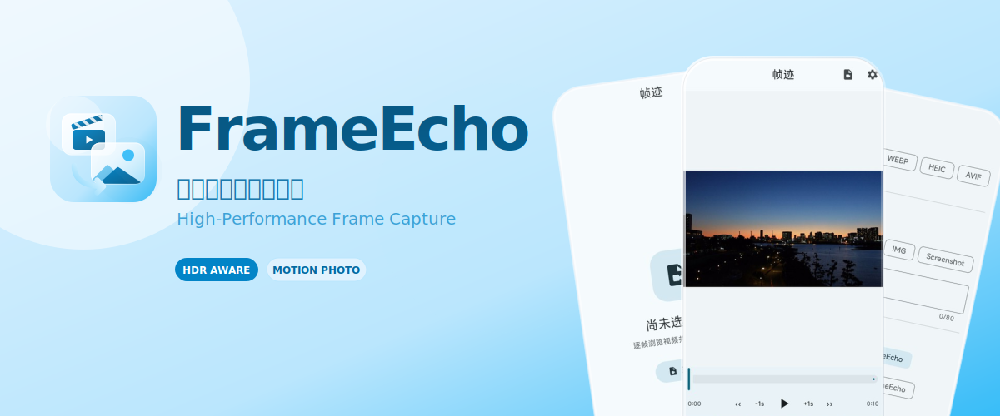
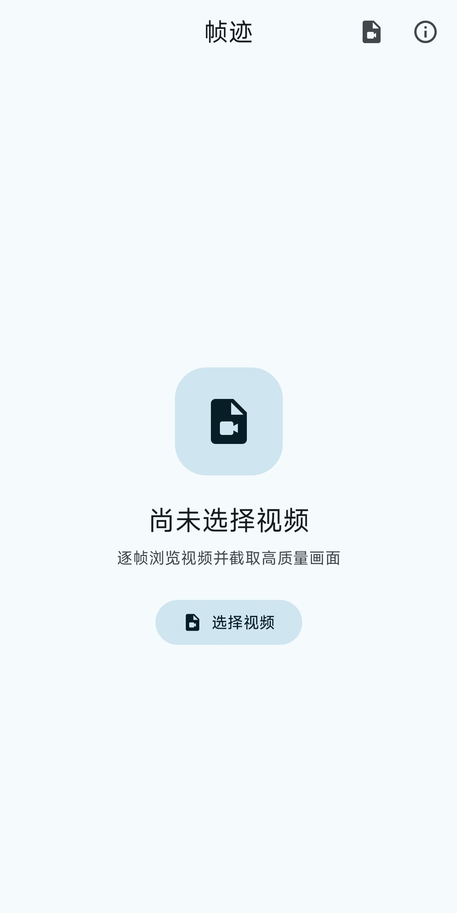
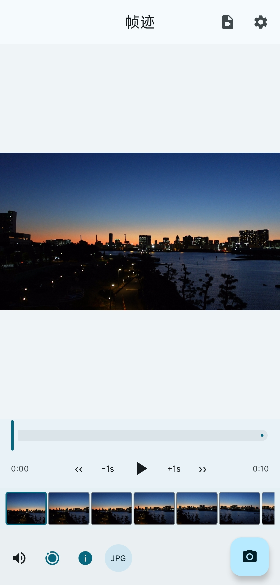
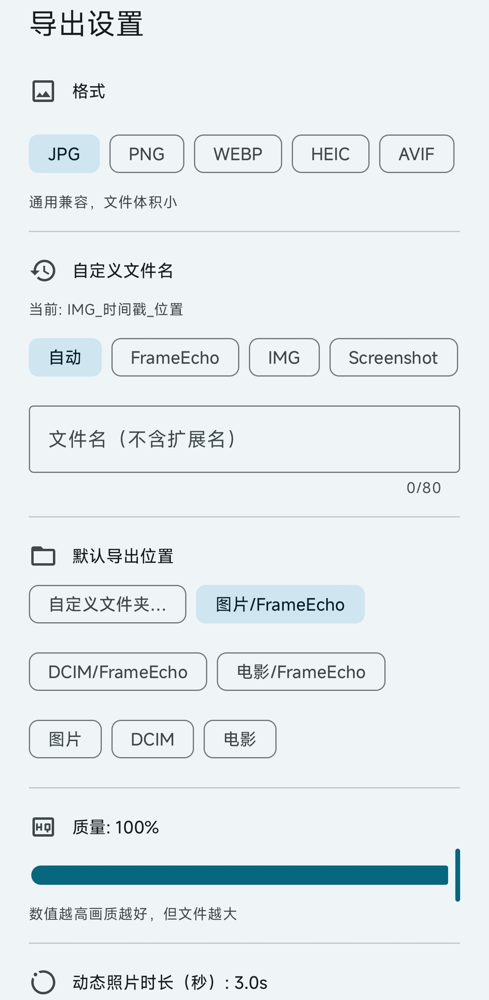

<div align="center">



<br/>

# FrameEcho

**定格你所爱的每一帧**
Android 高性能视频抽帧应用

从任意视频中精确截取完美画面，支持 HDR、动态照片与完整 EXIF 保留。通过快捷按钮和底部设置面板可调整格式、质量、导出目录、文件名、静音、HDR 色调映射等。

[](LICENSE)
[-green.svg)](https://developer.android.com/about/versions/oreo)
[](https://developer.android.com/about/versions/15)
[](https://kotlinlang.org/)
[](https://github.com/Shangjin-Xiao/FrameEcho/actions)

[English ↓](#-frameecho-1)　·　[官网](https://frameecho.shangjinyun.cn)　·　[下载](https://github.com/Shangjin-Xiao/FrameEcho/releases)

</div>

---

## ✨ 功能特性

- **微秒级精准抽帧** — 始终使用 `MediaMetadataRetriever.OPTION_CLOSEST` 精确定位帧，绝不回退至关键帧搜索
- **静态图 & 动态照片导出** — 支持 JPEG、PNG、WebP、HEIF、AVIF；动态照片遵循 [Google MicroVideo 规范](https://developer.android.com/media/camera/motion-photo-specification)（XMP + 附加 MP4）
- **音频静音选项** — 导出动态照片时可选择不包含音频
- **HDR & 杜比视界感知** — 通过 `MediaExtractor` 检测 HDR10、HDR10+、HLG 和杜比视界；为 SDR 格式进行色调映射，为 HEIF/AVIF 保留 HDR 数据
- **可配置 HDR 色调映射策略** — 自动 / 强制 SDR / 保留 HDR / 使用系统设置
- **快速切换控制栏** — 底栏一键切换静音、动图模式、元数据保留，并可单击格式按钮循环格式
- **自定义命名 & 导出目录** — 支持预设名称、手动输入、自定义文件夹（可通过 SAF 选择），带有效长度检查
- **无损元数据保存** — 从源视频读取完整 EXIF（拍摄日期、GPS、设备信息、ISO、曝光、焦距），通过 `androidx.exifinterface` 写入导出图片
- **品质优先默认值** — 默认 100% 质量、原始分辨率；用户可自行调整
- **质量与分辨率控制** — 100% 默认，可设置最大像素限制；输入值有边界检查
- **4K 视频 OOM 安全** — 显式 `recycle()` + 缩略图缓存，所有重操作运行在 `Dispatchers.IO`
- **懒加载缩略图时间线** — 基于 `LazyRow` 的时间线条，按需加载 120px 缩略图，带实时进度指示器
- **Material 3 界面** — 动态取色（Android 12+）、自定义播放控件（±5 秒快进/后退、实时拖动预览）、`ModalBottomSheet` 导出设置
- **Scoped Storage & SAF** — 严格使用 `MediaStore` API，支持保存到共享相册、DCIM、Movies 或自定义路径
- **中英双语** — 跟随系统语言自动切换

## 📱 界面预览

<table>
  <tr>
    <td align="center"></td>
    <td align="center"></td>
    <td align="center"></td>
  </tr>
  <tr>
    <td align="center"><strong>首页状态</strong><br/>选择视频后即可开始精准定位帧。</td>
    <td align="center"><strong>抽帧预览</strong><br/>时间线缩略图和播放器联动，方便精确停在目标画面。</td>
    <td align="center"><strong>导出设置</strong><br/>格式、质量、目录、HDR 与动态照片选项集中在底部面板。</td>
  </tr>
</table>

## 🏗️ 架构

```
FrameEcho/
├── app/                          # 应用模块（MVVM + Compose）
│   └── ui/
│       ├── player/               # 视频播放器 & 抽帧界面
│       │   ├── PlayerScreen.kt   # M3 Compose 界面
│       │   └── PlayerViewModel.kt# 状态管理 + 缩略图缓存
│       ├── about/                # 关于页面
│       ├── export/               # 导出设置底部弹窗
│       ├── components/           # ThumbnailTimeline（LazyRow）
│       └── theme/                # M3 主题（动态取色）
├── core/
│   ├── model/                    # 数据模型（ExportConfig、ColorSpaceInfo 等）
│   ├── media/                    # 媒体处理引擎
│   │   ├── extraction/           # FrameExtractor
│   │   ├── colorspace/           # HDR 检测 & 色调映射
│   │   ├── metadata/             # MetadataExtractor + MetadataWriter（EXIF）
│   │   └── export/               # FrameExporter（静态 + MicroVideo 动态照片）
│   └── common/                   # 共享工具（FileUtils）
├── .github/workflows/            # CI — 构建 APK & 运行测试
└── gradle/libs.versions.toml     # 版本目录
```

### 技术栈

| 层级 | 技术 |
|------|------|
| 语言 | **Kotlin 2.0** |
| UI | **Jetpack Compose** + Material 3（动态取色） |
| 视频播放 | **Media3 / ExoPlayer** |
| 帧提取 | `MediaMetadataRetriever`（`OPTION_CLOSEST`） |
| 缩略图时间线 | `getScaledFrameAtTime` + `LazyRow` |
| 色彩空间检测 | `MediaExtractor` → `MediaFormat` color-transfer / color-standard |
| 色调映射 | `HdrToneMapper` + 可配置策略（AUTO/SDR/HDR/SYSTEM） |
| 元数据 | `ExifInterface`（AndroidX）+ `MediaMetadataRetriever` |
| 动态照片 | `MediaMuxer` 剪辑提取 + XMP 注入（Google MicroVideo 规范） |
| 导出 | `MediaStore`（Scoped Storage），`Bitmap.compress`，可选择自定义目录（SAF） |
| 内存安全 | 显式 `recycle()`，缩略图缓存，`Dispatchers.IO` |
| 构建 | Gradle Kotlin DSL，版本目录 |
| CI | GitHub Actions |
| 最低 SDK | **26**（Android 8.0） |
| 目标 SDK | **35** |

## 🚀 构建

```bash
# 调试包
./gradlew assembleDebug

# 单元测试
./gradlew test

# 发布包
./gradlew assembleRelease
```


## 📄 许可证

本项目基于 [MIT License](LICENSE) 开源。

---

<div align="center">

## 🇬🇧 FrameEcho

**Freeze Every Frame You Love**

High-performance video frame capture for Android

Extract perfect screenshots from any video with HDR awareness, motion photo export, and full EXIF preservation. Quick‑access toggles and a settings sheet let you choose format, quality, export folder, filename template, mute audio and HDR tone‑mapping.

[Website](https://frameecho.shangjinyun.cn)　·　[Releases](https://github.com/Shangjin-Xiao/FrameEcho/releases)

</div>

## ✨ Features

- **Microsecond-Precise Frame Capture** — Always uses `MediaMetadataRetriever.OPTION_CLOSEST`; never falls back to keyframe seeking
- **Static & Motion Photo Export** — JPEG, PNG, WebP, HEIF, AVIF; motion photo follows [Google MicroVideo spec](https://developer.android.com/media/camera/motion-photo-specification)
- **Mute Audio Option** — omit audio when exporting motion photos
- **HDR & Dolby Vision Aware** — Detects HDR10, HDR10+, HLG, Dolby Vision; tone-maps to sRGB for SDR, preserves HDR for HEIF/AVIF
- **Configurable HDR Tone‑Mapping** — automatic / force SDR / preserve HDR / follow system setting
- **Quick‑Access Controls** — bottom toolbar lets you toggle mute, motion‑photo mode, metadata preservation and tap to cycle formats
- **Custom File Names & Export Locations** — presets, manual input with length validation, root folders or SAF-picked custom directory
- **Lossless Metadata Preservation** — full EXIF from source video written to exported image
- **Quality & Resolution Controls** — 100% default, adjustable quality and optional max resolution with bounds checks
- **OOM‑Safe with 4K Sources** — explicit `recycle()`, thumbnail caching, all heavy work on `Dispatchers.IO`
- **Lazy Thumbnail Timeline** — `LazyRow`‑based strip with on-demand 120px thumbnails and live position indicator
- **Material 3 UI** — Dynamic Color (Android 12+), custom playback controls, `ModalBottomSheet` export settings
- **Scoped Storage & SAF** — strict `MediaStore` API; gallery refreshes immediately after export

## 📱 Screens

<table>
  <tr>
    <td align="center"></td>
    <td align="center"></td>
    <td align="center"></td>
  </tr>
  <tr>
    <td align="center"><strong>Start clean</strong><br/>Open a video and jump straight into frame-accurate capture.</td>
    <td align="center"><strong>Capture view</strong><br/>Timeline thumbnails and playback stay in sync for precise frame picking.</td>
    <td align="center"><strong>Export sheet</strong><br/>Format, quality, HDR, metadata, and motion-photo options live in one place.</td>
  </tr>
</table>

## 🏗️ Architecture

### Tech Stack

| Layer | Technology |
|-------|-----------|
| Language | **Kotlin 2.0** |
| UI | **Jetpack Compose** + Material 3 (Dynamic Color) |
| Video Playback | **Media3 / ExoPlayer** |
| Frame Extraction | `MediaMetadataRetriever` (`OPTION_CLOSEST` always) |
| Thumbnail Timeline | `getScaledFrameAtTime` + `LazyRow` |
| Color Space | `MediaExtractor` → `MediaFormat` color-transfer / color-standard |
| Tone Mapping | `HdrToneMapper` + strategy enum |
| Metadata | `ExifInterface` (AndroidX) + `MediaMetadataRetriever` |
| Motion Photo | `MediaMuxer` clip extraction + XMP injection (Google MicroVideo spec) |
| Export | `MediaStore` (scoped storage), `Bitmap.compress`, optional custom folder (SAF) |
| Memory Safety | explicit `recycle()`, thumbnail caching, `Dispatchers.IO` |
| Build | Gradle Kotlin DSL, Version Catalog |
| CI | GitHub Actions |
| Min SDK | **26** (Android 8.0) |
| Target SDK | **35** |

## 🚀 Build

```bash
./gradlew assembleDebug    # Debug APK
./gradlew test             # Unit tests
./gradlew assembleRelease  # Release APK
```

## 📄 License

MIT License.
